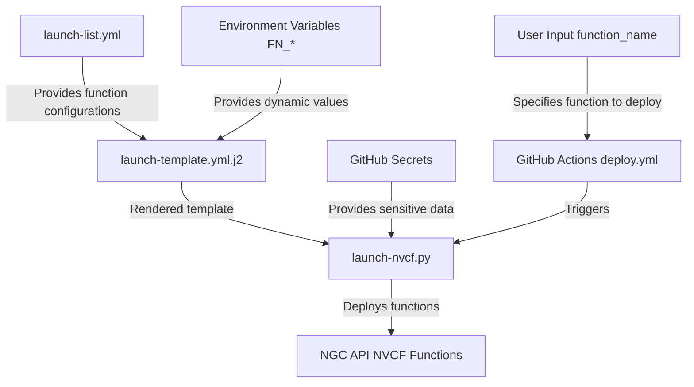

# ci-nvcf

## Overview

This repo provides a starting point for automating NVCF function deployments and updates using GitHub Actions. At a high level, we have a file named `launch-list.yml` that contains a list of functions we want to deploy. Everytime you push an update to main, the provided workflows will build and push your Docker image to NGC, update the `launch-list.yml` with the new image tag, and then deploy the function(s) to NGC using the `launch-nvcf.py` script.

This repo is designed to be modular. You can simply clone this repo and start modifying workflows to fit your needs or use this as a reference to build your own.

## Getting Started

1. **GitHub Secrets**:
   Ensure the following secrets are configured in your GitHub repository. Note that any environment variables prefixed with `FN_` will be automatically consumed by the Jinja2 template:
   - `PRD_NVCF_API_KEY`: Required to manage your functions and function lifecycles.
   - `FN_NGC_ORG`: Your NGC organization name.
   - `FN_NGC_TEAM`: Your NGC team name.
   - `FN_HUGGING_FACE_HUB_TOKEN`: If using Hugging Face models (optional).
   - Any additional `FN_*` variables required by your specific setup.

2. **NGC Setup**:
   - Push your **Container Image** to the NGC Private Registry (nvcr.io) correlated to your org and/or team.
   - If necessary, push any referenced **Models** to the NGC Private Registry.
   - Note: Using workflows to automatically push to NGC will differ depending on your current container CI. Take a look at `docs/container-ci-setup.md` for some inspiration.

3. **Repository Configuration**:
   - Clone this repository into your Github account
   - Update `launch-list.yml` with your image tag and function configurations
   - Adjust the `launch-template.yml.j2` to define baseline function configurations. You'll need to edit this if you plan to use models from NGC.

## Key Components

1. `launch-nvcf.py`: The main Python script that handles the deployment of NVCF functions.
2. `launch-list.yml`: Configuration file defining the functions to be deployed.
3. `launch-template.yml.j2`: Jinja2 template for generating function configurations.
4. `update-launch-list.py`: Script to update the `launch-list.yml` with new image tags. We use this to signal a new version of the container image to be deployed.
5. GitHub Action workflows:
   - `push-to-ngc.yaml`: Builds and pushes your container image to NGC
   - `deploy.yaml`: Handles the deployment of functions.

## Workflow Pipeline

#### 1. Push to NGC (`push-to-ngc.yml`)

This workflow is responsible for building and pushing your container image to NGC. It also updates the `launch-list.yml` with the new image tag.

#### 2. Deploy Function (`deploy.yml`)

This workflow deploys the function(s) defined in `launch-list.yml` to NGC using the `launch-nvcf.py` script. This script is a wrapper around the NGC API that handles the creation and management of NVCF functions.

## Local Execution & Testing

To test the deployment process locally:

1. **Set Environment Variables**:

```bash
export PRD_NVCF_API_KEY="your_ngc_org_api_key"
export FN_NGC_ORG="your_ngc_org"
export FN_NGC_TEAM="your_ngc_team"
export FN_SAMPLE_FUNCTION_NAME=inference-l40sx1 # correlates to function list item
export FN_HUGGING_FACE_HUB_TOKEN="hf_xxxx"
# Optional
export FN_NGC_MODEL=sample-model
export FN_NGC_MODEL_VERSION=0.1
```

2. **Install Prerequisites**:

```bash
pip install virtualenv
virtualenv .venv
source .venv/bin/activate
pip install yq pydantic PyYAML Jinja2 colorlog pytz requests
```

3. **Run the Deployment Script**:

```bash
python3 launch-nvcf.py --manifest templates/launch-template.yml.j2 --environment production --function-name ${FN_SAMPLE_FUNCTION_NAME}
```

You can also manually trigger the `test-` workflows

## Using Models

If referencing any models (i.e. for volume mounts) ensure these models exist and have been uploaded to NGC:

```bash
ngc registry model --org ${FN_NGC_ORG} create --application Other --framework Other --precision Other --format Other --short-desc ${FN_NGC_MODEL} ${FN_NGC_ORG}/${FN_NGC_TEAM}/${FN_NGC_MODEL}

cd your/model/dir

ngc registry model --org ${FN_NGC_ORG} --team ${FN_NGC_TEAM} upload-version ${FN_NGC_ORG}/${FN_NGC_TEAM}/${FN_NGC_MODEL}:${FN_NGC_MODEL_VERSION}
```

## Notes

- These Github actions reference a prebuilt image with all prereqs installed: quay.io/liveaverage/ci-builder:latest (https://github.com/liveaverage/ci-builder)

### Diagram



