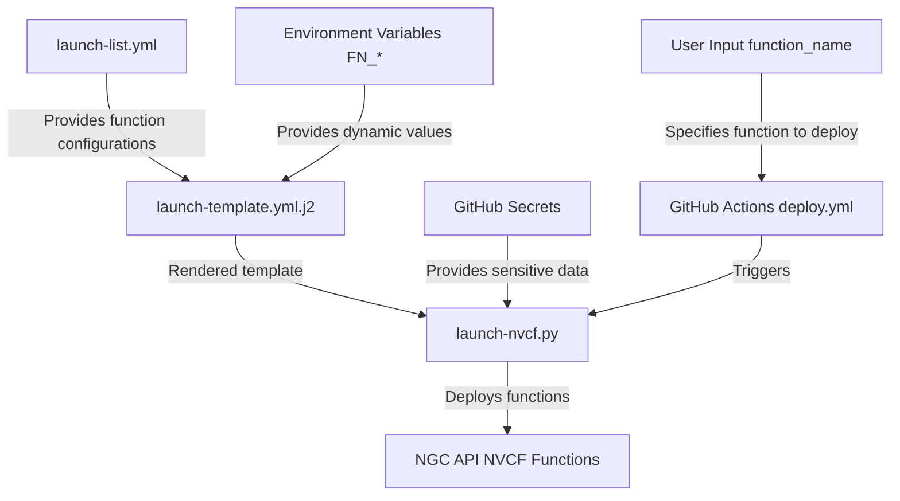

# ci-nvcf

## Getting Started

- Push your **Container Image** to the NGC Private Registry (nvcr.io) correlated to your org and/or team
- If necessary, push any referenced **Models** to the NGC Private Registry
- Adjust the core `templates/launch-template.yml.j2` to define your baseline function config
- Update `launch-list.yml` with appropriate parameters for all individual function launch configurations
- Ensure GitHub Secrets are configured for actions
  - `PRD_NVCF_API_KEY`
    - This is required to manage your functions and function lifecycles
  - `FN_*`
    - Any environment variables prefixed with `FN_` are automatically consumed by Jinja2 templates

## Local Execution & Testing

Set environment variables matching GitHub secrets
```bash
# Required
export PRD_NVCF_API_KEY="your_ngc_org_api_key"
export FN_NGC_ORG="your_ngc_org"
export FN_NGC_TEAM="your_ngc_team"

export FN_SAMPLE_FUNCTION_NAME=inference-l40sx1 # correlates to function list item
export FN_HUGGING_FACE_HUB_TOKEN="hf_xxxx"

# Optional
export FN_NGC_MODEL=sample-model
export FN_NGC_MODEL_VERSION=0.1
```

If referencing any models (i.e. for volume mounts) ensure these models exist and have been uploaded to NGC:
```bash
ngc registry model --org ${FN_NGC_ORG} create --application Other --framework Other --precision Other --format Other --short-desc ${FN_NGC_MODEL} ${FN_NGC_ORG}/${FN_NGC_TEAM}/${FN_NGC_MODEL}

cd your/model/dir

ngc registry model --org ${FN_NGC_ORG} --team ${FN_NGC_TEAM} upload-version ${FN_NGC_ORG}/${FN_NGC_TEAM}/${FN_NGC_MODEL}:${FN_NGC_MODEL_VERSION}
```

Install prereqs:
```bash
pip install virtualenv
virtualenv .venv
. .venv/bin/activate
pip install yq pydantic PyYAML Jinja2 colorlog pytz requests
```

Attempt launching your function(s):
```bash
python3 launch-nvcf.py --manifest templates/launch-template.yml.j2 --environment production --function-name ${FN_SAMPLE_FUNCTION_NAME}
```


## Notes

- These Github actions reference a prebuilt image with all prereqs installed: quay.io/liveaverage/ci-builder:latest (https://github.com/liveaverage/ci-builder)

### Diagram 

